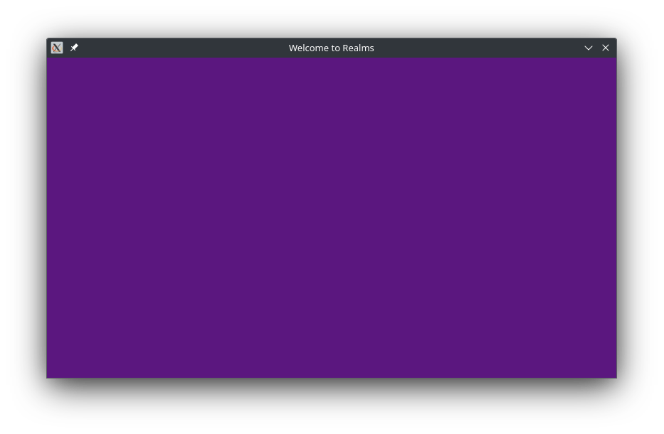

# Realms example #1 - a basic window

## Code

``` rust
use realms::node::{Fill, Node};
use realms::{Color, Window};

pub fn main() {
    let mut win = Window::new("Welcome to Realms", 800, 450); // create window frame
    let fill = Fill::new(Color::rgb(91, 23, 127)); // fill node to fill window blue

    while win.running {
        fill.draw(&mut win); // fill the window blue
        win.flip(); // flip the buffers to display the new background
    }
}
```

## Output



## Explanation

> Currently unfinished - sorry!
